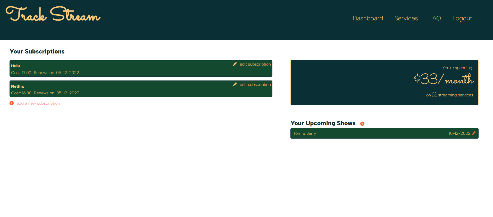

## App name
# Track Stream

## Decription
# Track Stream's purpose is to keep you notified of all the video streaming services you are subscribed too. The application will give you a visual reminder of how much you're spending on streaming services and when the renewal period starts again. 

## Technologies used
# Simple Grid – Simple, responsive CSS Grid system
# Moment.js - parse and format dates in Javascript
# Node packages: bcrypt, handlebars, express-session, dotenv, mysql2, sequelize
# Styling: Bootstrap Icons & Google Fonts

## How to use
1. Go to the following Heroku link https://shielded-thicket-83954.herokuapp.com/
2. Sign up and log in
3. Add video streaming platforms of your choice
4. Add the renewal date and how often you're paying for the subscription
5. Add shows that you're looking foward to watching and their premiere dates

## Installation Instructions
1. Clone the repo.
2. Run npm install at the root folder of this project
3. Create a .env file at the root folder of this project with the following format:   
    DB_NAME='Name'  
    DB_USER='User'  
    DB_PASSWORD='password'  
4. Open a mysql shell and run source db/schema.sql.
5. Quit the mysql shell and run npm start.
6. Once you've started the server, access the app at http://localhost:3001

# Screenshot of app

# Link to deployed heroku app
# https://shielded-thicket-83954.herokuapp.com/

## Credits
# Kate Lam GitHub: Kate-github
# Luis Garcia GitHub: garcia2697
# Valerie Gleason GitHub: hellovolcano